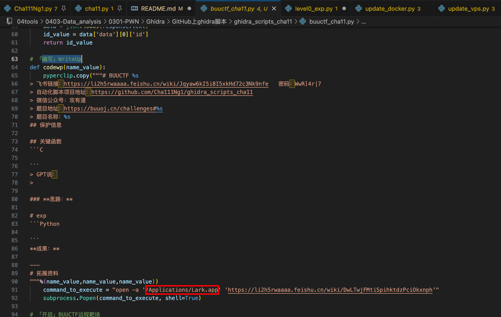
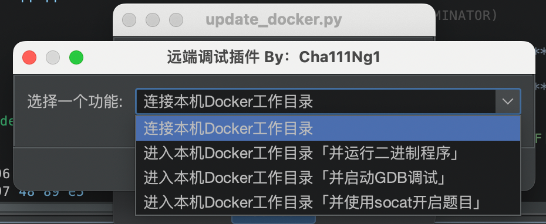

# ghidra_scripts_cha11

  

> Ghidra变强术，一个Ghidra脚本库
> 
> 微信公众号：攻有道
> 
> 项目地址：https://github.com/Cha111Ng1/ghidra_scripts_cha11

# 前言

- 以下脚本均在Mac下完成，对其他系统可能存在不适配性，这里提供代码，仅供参考，大家可根据自己的需求自行修改，涉及Python库自行安装，这些功能都是平常个人使用频率较高的，刷题嘎嘎香。
    
- 所有Python代码均基于Python3，如无法使用请参考《Ghidra之 什么？为啥你的Ghidra是Python3》https://mp.weixin.qq.com/s/c8LMwNIK3CEVDA3FJo-lLg 切换默认Python（默认的是jpython）。
    
# V1.1
## 添加配置文件
- 脚本路径配置统一移至config.ini
  - Mac用户新建~/.config/ghidra_scripts_cha11/config.ini，使用下面示例文件内容格式。
- buuctf_cha11.py添加自动登录获取用户凭证初始化模块


示例配置文件
```text
[benji]
# 本机buuctf工作目录
root_path = /Users/root/tools/tool/03SmartSpace/CTF/CTF-刷题/buuctf/

[docker]
# 用于实验的docker容器，dockerid设置为容器ID
dockerid = 1a885ef5a5c9998a280c6bc337cc74161faf5aed92696850b54d114155499306
# 新建容器时映射的物理机文件，（我使用的启动命令：docker run -tid --cap-add=SYS_PTRACE --security-opt seccomp=unconfined --name cha11pwn -p 1337:1337 -v /Users/root/tools/tool/03SmartSpace/CTF/CTF-刷题:/home/pwntools/ pwntools/pwntools）
dockerlj = /Users/root/tools/tool/03SmartSpace/CTF/CTF-刷题/

[qemu]
# 用于实验的qemu机器ip地址
vpsip = 192.168.216.2
# ssh端口
vpsport = 22
# qemu上ctf工作空间根目录
vpsrootpath = /home/cha111ng1/tools/ctf

[vps]
# 用于实验的远程机器
vpsip = x.x.x.x
# ssh端口
vpsport = 22
# vps上ctf工作空间根目录
vpsrootpath = /root/tools/ctf

[buuctf]
# buuctf登录名
user = Cha111Ng1@qq.com
# buuctf登录密码
password = ********
buusession = 079a8a91-b93c-4239-8711-7a68f3dc79bd.N3lfgVbsE9hWWm7W8gXiOw1L8Ps
buucsrf_nonce = ee5cfc2482637b408a51fe1be292fd2f61adaddca3d5f1a61e41ace4774a82ee

[codeexp]
codefile = /usr/local/bin/code

[ida]
# ida安装根目录路径
idahome = /Applications/IDA\ Pro\ 7.0/ida.app/Contents/MacOS/
```

# V1.0
## 导入脚本文件夹


## 勾选脚本


## 菜单栏路径


# Ghidra自动化操作

在使用Ghidra的过程中会存在一些重复性的工作，该模块有助于节约生命。

## Cha111Ng1.py

一个查看当前二进制文件信息的脚本（这里对不齐！！！希望你是个强迫症[微笑]）

### 运行效果


## buuctf_cha11.py

BUUCTF刷题脚本，半自动下载题目，开启靶机，提交flag，关闭靶场，查找资料

### 脚本需修改

飞书安装路径或钉钉安装路径，以及BUUCTF登录凭证信息，BUUCTF题根目录




### 运行效果


## code_exp.py

### 脚本需修改

你可能需修改为你vscode的安装路径

### 运行效果


## ida_cha11.py

自动使用32/64位IDA打开二进制文件进行分

### 脚本需修改

修改为你IDA的安装路径

### 运行效果


## update_docker.py

进入docker容器分析，其中需要配置的内容有，设置你的容器ID，以及创建容器时，做好文件夹和端口的映射，我这里使用的docker容器是pwntools，大家可以参考，不过M1环境下的docker里面的gdb无法使用，后面我选择了QEMU

```Python
docker run -tid --cap-add=SYS_PTRACE --security-opt seccomp=unconfined --name cha11pwn2 -p 1337:1337 -v /Users/root/tools/tool/03SmartSpace/CTF/CTF-刷题:/home/pwntools/ pwntools/pwntools
```

### 脚本需修改

创建容器后，代码中修改位置图中第59行，修改为你的容器ID或名称


### 运行效果



## update_qemu.py

进入qemu虚拟机分析，M1配置qemu安装x86虚拟机相关教程请参见：https://mp.weixin.qq.com/s/jMFMYB1aZaljZ_HtKZxPKg

### 脚本需修改

参考update_vps.py

### 运行效果


## update_vps.py

上传至VPS分析

### 脚本需修改


### 运行效果


# Ghidra自动化分析

敬请期待...

  

---

# 拓展资料

《GhidraAPI文档》

《Ghidra之 什么？为啥你的Ghidra是Python3》：https://mp.weixin.qq.com/s/c8LMwNIK3CEVDA3FJo-lLg

《Ghidra之 什么？你的M1为啥可以gdb》：https://mp.weixin.qq.com/s/jMFMYB1aZaljZ_HtKZxPKg